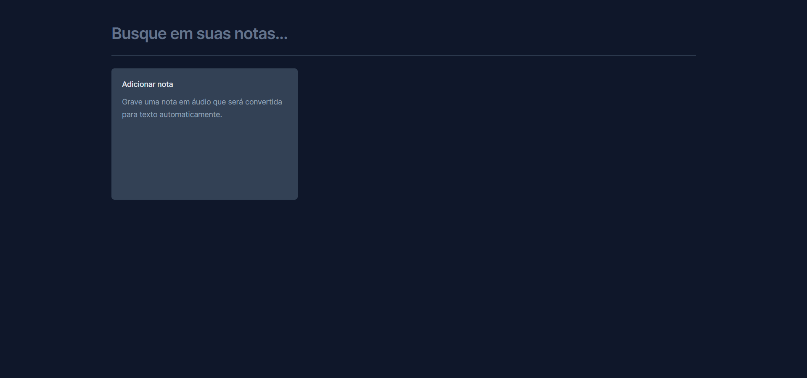
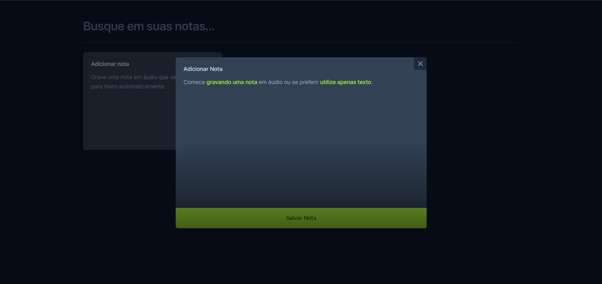
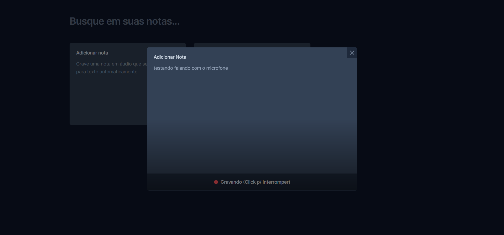
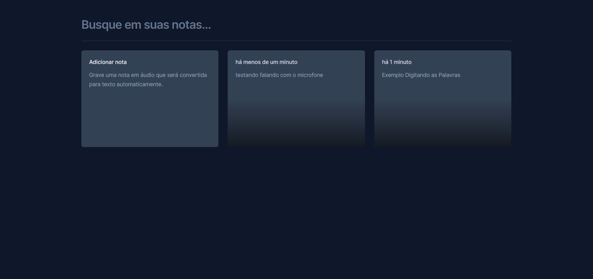

# Notepad (React)

Esta aplicação foi desenvolvida utilizando **React**, **TypeScript**, **Tailwind** e a **SpeechRecognition API**.


## Executando

Após clonar o repositório, acesse a pasta do projeto e execute os comandos abaixo:

```sh
npm install
npm run dev
```

Acesse http://localhost:5173 para visualizar a aplicação.

# Imagens do Notepad

### Tela Principal



### Tela de Criação de uma Anotação



### Tela de Gravação da Nota (usando o microfone)



### Tela com Anotações


